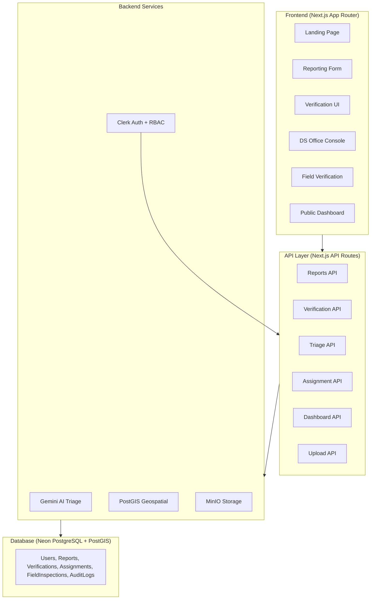

# CivicPulse LK — Implementation Plan

Community-Verified Public Infrastructure Reporting Platform for Sri Lanka. This plan covers the full build-out of a Next.js application with 6 core modules: Citizen Reporting, Community Verification, AI Triage, DS Office Console, Field Verification, and Public Dashboard.

---

## User Review Required

> [!IMPORTANT]
> **Tech Stack Confirmation** — The project context specifies Next.js + Tailwind CSS + Shadcn UI + Prisma + Neon (PostgreSQL) + Clerk Auth + Gemini AI + MinIO + Mapbox. This plan follows that stack exactly. Please confirm before we proceed.

> [!WARNING]
> **API Keys & Services Needed Before Dev Starts:**
> - **Clerk** account + publishable/secret keys (auth)
> - **Neon DB** project + connection string (PostgreSQL + PostGIS)
> - **Google Gemini API** key (AI triage)
> - **Mapbox** access token (maps & geofencing)
> - **MinIO** instance URL + access/secret keys (photo storage)
>
> You can provide these later via `.env.local`, but the sooner the better.

> [!CAUTION]
> **PostGIS Extension** — Neon DB must have the PostGIS extension enabled for geospatial queries. You'll need to run `CREATE EXTENSION IF NOT EXISTS postgis;` on your Neon project.

---

## Open Questions

1. **Deployment target** — Vercel (as stated in context) or a different platform? Vercel's free tier has limits on API route duration (10s) which may affect AI triage.
2. **MinIO hosting** — Self-hosted on a VPS, or would you prefer Cloudflare R2 / Vercel Blob as a simpler S3-compatible alternative?
3. **Mobile app** — The context mentions "web + mobile app" and Flutter. Should we build a separate Flutter app, or is a responsive PWA (Progressive Web App) sufficient for the MVP?
4. **Language translations** — Do you have Sinhala/Tamil translation strings ready, or should we scaffold the i18n system with English-only and add translations later?
5. **Redis & Elasticsearch** — Mentioned in expected outcomes but not in the core tech stack. Should we include these in the MVP, or defer to a later phase?
6. **Mapbox vs Leaflet** — Mapbox requires a paid plan for commercial use. Would you prefer free Leaflet + OpenStreetMap for the MVP?

---

## Architecture Overview



---

## Proposed Changes

### Phase 1: Project Scaffolding & Foundation

#### [NEW] Project initialization
- Initialize Next.js 15 app with App Router, TypeScript, Tailwind CSS, ESLint
- Install core dependencies: `@clerk/nextjs`, `prisma`, `@prisma/client`, `shadcn-ui`, `@google/generative-ai`, `minio`, `zod`, `react-hook-form`, `@hookform/resolvers`, `next-intl`, `mapbox-gl` / `react-map-gl`
- Configure Tailwind with Shadcn UI theme (dark mode support)
- Set up path aliases (`@/components`, `@/lib`, `@/app`, etc.)

#### [NEW] `prisma/schema.prisma`
Core database models:

```prisma
// Key models (simplified)
model User {
  id            String   @id @default(cuid())
  clerkId       String   @unique
  role          Role     @default(CITIZEN)
  trustScore    Float    @default(0)
  preferredLang Language @default(EN)
  // ... relations
}

model Report {
  id            String       @id @default(cuid())
  citizenId     String
  category      Category
  description   String
  summary       String?      // AI-generated
  latitude      Float
  longitude     Float
  location      Unsupported("geography(Point, 4326)")?
  photos        Photo[]
  status        ReportStatus @default(SUBMITTED)
  priority      Priority?    // AI-suggested
  duplicateOfId String?      // AI duplicate detection
  // ... verification, assignment relations
}

model Verification {
  id         String             @id @default(cuid())
  reportId   String
  verifierId String
  status     VerificationStatus // CONFIRMED, DISPUTED, NEEDS_INFO
  comment    String?
  photos     Photo[]
  // ... GPS evidence
}

model Assignment {
  id          String @id @default(cuid())
  reportId    String
  dsOfficerId String
  assignedTo  String // agency/NGO/volunteer
  // ... status tracking
}

model FieldInspection {
  id           String @id @default(cuid())
  assignmentId String
  inspectorId  String
  findings     String
  photos       Photo[]
  gpsLatitude  Float
  gpsLongitude Float
  // ... resolution details
}

model AuditLog {
  id        String   @id @default(cuid())
  userId    String
  action    String
  entity    String
  entityId  String
  metadata  Json?
  createdAt DateTime @default(now())
}
```

Enums: `Role` (CITIZEN, VERIFIER, DS_OFFICER, AGENCY, NGO, VOLUNTEER, ADMIN), `Category` (ROAD_DAMAGE, DRAINAGE, STREETLIGHT, WATER_SUPPLY, WASTE, BRIDGE, PUBLIC_BUILDING, OTHER), `ReportStatus` (SUBMITTED, UNDER_VERIFICATION, VERIFIED, ASSIGNED, IN_PROGRESS, FIELD_VERIFIED, RESOLVED, REJECTED), `Priority` (CRITICAL, HIGH, MEDIUM, LOW), `Language` (EN, SI, TA)

#### [NEW] `.env.local.example`
Template for all required environment variables.

#### [NEW] `src/lib/db.ts`
Singleton Prisma client pattern (prevent connection exhaustion in dev).

#### [NEW] `src/lib/minio.ts`
MinIO client initialization + upload/download helpers.

#### [NEW] `src/middleware.ts`
Clerk middleware with RBAC route protection.

---

### Phase 2: Authentication & Role System

#### [NEW] `src/app/(auth)/sign-in/[[...sign-in]]/page.tsx`
Clerk sign-in page with custom styling.

#### [NEW] `src/app/(auth)/sign-up/[[...sign-up]]/page.tsx`
Clerk sign-up page with role selection (Citizen default).

#### [NEW] `src/lib/auth.ts`
- Role-based access control helpers
- `requireRole()`, `getCurrentUser()`, `hasPermission()` utilities
- Role hierarchy enforcement

#### [NEW] `src/app/api/webhooks/clerk/route.ts`
Clerk webhook to sync user data to our PostgreSQL `User` table on sign-up/update.

---

### Phase 3: Landing Page & Core UI

#### [NEW] `src/app/(public)/page.tsx` — Landing Page
Sections:
- **Hero** — Bold headline, CTA button, animated background
- **Problem** — Statistics on infrastructure complaints in Sri Lanka
- **How It Works** — 4-step flow (Report → Verify → Assign → Resolve) with icons
- **Features** — Key platform features with cards
- **CTA** — Sign up / Start Reporting buttons

#### [NEW] `src/components/layout/navbar.tsx`
- Logo + nav links
- Clerk `<UserButton />` with role-based navigation
- Language switcher (EN/SI/TA)
- Mobile-responsive hamburger menu

#### [NEW] `src/components/layout/footer.tsx`
#### [NEW] `src/components/ui/` — Shadcn UI components
Install via CLI: Button, Card, Dialog, Form, Input, Select, Textarea, Badge, Toast, Tabs, Table, DropdownMenu, Sheet, etc.

---

### Phase 4: Citizen Reporting Module

#### [NEW] `src/app/(protected)/reports/new/page.tsx`
Report submission form with:
- Category dropdown (road, drainage, streetlight, etc.)
- Description textarea
- Photo upload (drag & drop, multiple images, preview)
- GPS auto-capture (browser Geolocation API) + Mapbox pin placement
- Language selector for description

#### [NEW] `src/app/api/reports/route.ts`
- `POST /api/reports` — Create report with Zod validation
- `GET /api/reports` — List reports (filtered by status, category, proximity)
- Upload photos to MinIO, store URLs in DB
- Trigger AI triage (async) after creation

#### [NEW] `src/app/(protected)/reports/[id]/page.tsx`
Report detail page — view full info, verification status, assignment, resolution timeline.

#### [NEW] `src/app/(protected)/reports/page.tsx`
"My Reports" list — citizen sees their submitted reports with status badges.

---

### Phase 5: Community Verification Module

#### [NEW] `src/app/(protected)/verify/page.tsx`
- Map view showing nearby unverified reports (PostGIS proximity query)
- Card list of reports needing verification
- Filter by category, distance radius

#### [NEW] `src/app/(protected)/verify/[id]/page.tsx`
Verification form:
- Confirm / Dispute / Needs More Info
- Add comment + optional photos
- GPS evidence auto-captured

#### [NEW] `src/app/api/verifications/route.ts`
- `POST /api/verifications` — Submit verification
- Update report status when confirmation threshold met (e.g., 3 confirms → VERIFIED)
- Update verifier's trust score
- Proximity check: verifier must be within X km of report (PostGIS `ST_DWithin`)

#### [NEW] `src/lib/trust-score.ts`
Trust score calculation logic:
- Base score on verification accuracy history
- Bonus for consistent verifiers
- Penalty for repeatedly disputed verifications

---

### Phase 6: AI Triage Service

#### [NEW] `src/lib/ai/triage.ts`
Gemini AI integration for:
1. **Duplicate Detection** — Compare new report description + location against recent reports; flag potential duplicates
2. **Category Classification** — Auto-suggest category from description text
3. **Priority Scoring** — Assess urgency (CRITICAL/HIGH/MEDIUM/LOW) based on description, category, photo analysis
4. **Description Summarization** — Generate concise summary for DS Office review

#### [NEW] `src/app/api/triage/route.ts`
- `POST /api/triage` — Run AI triage on a report (called async after report creation)
- Store results as advisory metadata on the report (never auto-overrides human decisions)

#### [NEW] `src/lib/ai/prompts.ts`
Structured prompts for each triage function with consistent output schemas.

---

### Phase 7: DS Office Coordination Console

#### [NEW] `src/app/(protected)/ds-console/page.tsx`
Dashboard for DS Officers:
- Verified reports queue (sortable by priority, category, date, location)
- Map view of all verified reports in jurisdiction
- Quick-assign actions

#### [NEW] `src/app/(protected)/ds-console/[id]/page.tsx`
Report detail + assignment form:
- View report + verifications + AI triage results
- Assign to: Government Agency / NGO / Volunteer Team
- Add notes, set deadline
- Request field verification

#### [NEW] `src/app/api/assignments/route.ts`
- `POST /api/assignments` — Assign verified report to agency/NGO
- `PATCH /api/assignments/:id` — Update assignment status
- Audit log every action

#### [NEW] `src/app/(protected)/ds-console/agencies/page.tsx`
Manage agencies/NGOs/volunteer teams available for assignment.

---

### Phase 8: Field Verification & Evidence Capture

#### [NEW] `src/app/(protected)/field/page.tsx`
Field inspector's view — assigned reports for field verification.

#### [NEW] `src/app/(protected)/field/[id]/page.tsx`
Field verification form:
- Inspection findings textarea
- Photo capture (camera integration)
- GPS auto-capture for proof of presence
- Resolution status (CONFIRMED_RESOLVED, PARTIALLY_RESOLVED, NOT_RESOLVED, ESCALATE)

#### [NEW] `src/app/api/inspections/route.ts`
- `POST /api/inspections` — Submit field inspection
- Update report status based on findings
- Attach evidence to auditable record

---

### Phase 9: Public Transparency Dashboard

#### [NEW] `src/app/(public)/dashboard/page.tsx`
Public-facing dashboard:
- **Overview stats** — Total reports, verified, resolved, avg resolution time
- **Status chart** — Pie/bar chart of reports by status
- **Category breakdown** — Reports by category
- **Map view** — All reports color-coded by status
- **Recent activity** — Timeline of recent verifications and resolutions
- **Filters** — By district, category, date range, status

#### [NEW] `src/app/api/dashboard/route.ts`
Aggregation queries for dashboard analytics.

#### [NEW] `src/components/charts/` 
Chart components using a lightweight charting library (Recharts or Chart.js).

---

### Phase 10: Internationalization (i18n)

#### [NEW] `src/i18n/` — i18n setup with `next-intl`
- `en.json`, `si.json`, `ta.json` message files
- Language switcher component
- Middleware for locale detection
- All user-facing strings extracted to message files

---

### Phase 11: Testing & Quality

#### [NEW] Test setup
- Unit tests with Vitest for utility functions, trust score calculation, AI prompt builders
- Integration tests for API routes (Prisma + test DB)
- E2E tests with Playwright for critical flows:
  - Submit report → Community verify → DS assign → Field verify → Resolve
  - Role-based access control
  - Language switching

---

### Phase 12: DevOps & Deployment

#### [NEW] `.github/workflows/ci.yml`
GitHub Actions CI pipeline:
- Lint + type-check on PR
- Run tests
- Preview deployment on Vercel

#### [NEW] `docker-compose.yml`
Local dev setup with PostgreSQL + PostGIS + MinIO containers.

#### [NEW] Vercel deployment config
- Environment variables
- Neon DB staging/production branches
- Domain setup

---

## Folder Structure

```
CivicPulse-LK-/
├── prisma/
│   └── schema.prisma
├── public/
│   ├── images/
│   └── locales/
├── src/
│   ├── app/
│   │   ├── (auth)/
│   │   │   ├── sign-in/[[...sign-in]]/page.tsx
│   │   │   └── sign-up/[[...sign-up]]/page.tsx
│   │   ├── (public)/
│   │   │   ├── page.tsx              # Landing page
│   │   │   └── dashboard/page.tsx    # Public dashboard
│   │   ├── (protected)/
│   │   │   ├── reports/
│   │   │   │   ├── page.tsx          # My reports
│   │   │   │   ├── new/page.tsx      # Submit report
│   │   │   │   └── [id]/page.tsx     # Report detail
│   │   │   ├── verify/
│   │   │   │   ├── page.tsx          # Nearby reports to verify
│   │   │   │   └── [id]/page.tsx     # Verification form
│   │   │   ├── ds-console/
│   │   │   │   ├── page.tsx          # DS Officer dashboard
│   │   │   │   ├── [id]/page.tsx     # Assign report
│   │   │   │   └── agencies/page.tsx # Manage agencies
│   │   │   └── field/
│   │   │       ├── page.tsx          # Field assignments
│   │   │       └── [id]/page.tsx     # Field verification form
│   │   ├── api/
│   │   │   ├── reports/route.ts
│   │   │   ├── verifications/route.ts
│   │   │   ├── triage/route.ts
│   │   │   ├── assignments/route.ts
│   │   │   ├── inspections/route.ts
│   │   │   ├── dashboard/route.ts
│   │   │   ├── upload/route.ts
│   │   │   └── webhooks/clerk/route.ts
│   │   ├── layout.tsx
│   │   └── globals.css
│   ├── components/
│   │   ├── layout/ (navbar, footer, sidebar)
│   │   ├── ui/ (shadcn components)
│   │   ├── reports/ (report-card, report-form, report-map)
│   │   ├── verification/ (verify-card, verify-form)
│   │   ├── dashboard/ (stats-card, charts)
│   │   └── shared/ (language-switcher, map-view, photo-upload)
│   ├── lib/
│   │   ├── db.ts            # Prisma singleton
│   │   ├── minio.ts         # MinIO client
│   │   ├── auth.ts          # RBAC helpers
│   │   ├── validators.ts    # Zod schemas
│   │   ├── trust-score.ts   # Trust score logic
│   │   └── ai/
│   │       ├── triage.ts    # Gemini AI integration
│   │       └── prompts.ts   # AI prompt templates
│   ├── i18n/
│   │   ├── en.json
│   │   ├── si.json
│   │   └── ta.json
│   ├── hooks/ (custom React hooks)
│   ├── types/ (TypeScript type definitions)
│   └── middleware.ts        # Clerk + RBAC middleware
├── .env.local.example
├── docker-compose.yml
├── .github/workflows/ci.yml
├── next.config.ts
├── tailwind.config.ts
├── tsconfig.json
└── package.json
```

---

## Verification Plan

### Automated Tests
- `npm run lint` — ESLint + TypeScript type checking
- `npm run test` — Vitest unit tests (trust score, validators, AI prompts)
- `npm run test:e2e` — Playwright E2E (full report lifecycle)
- `npx prisma validate` — Schema validation
- `npx prisma db push --dry-run` — Migration dry run

### Manual Verification
- Submit a test report with photo + GPS → verify it appears on verification page
- Community verify the report → confirm status updates to VERIFIED
- DS Officer assigns report → confirm agency notification
- Field inspector submits inspection → confirm resolution flow
- Public dashboard reflects real-time data
- Language switching works across all pages (EN/SI/TA)
- Role-based access: citizen cannot access DS console, etc.
- Responsive design on mobile devices
